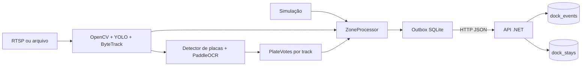

# Arquitetura

## Escopo e tecnologias

A POC processa uma fonte de vídeo e um polígono de doca por worker. O monorepo
contém Python 3.11 no container, API .NET 10 com Npgsql e PostgreSQL 17. O pacote
Python declara suporte a versões `>=3.11,<3.13`.

O Python é um **worker**, sem servidor FastAPI. A interface HTTP pertence à API
.NET. O OCR escolhido é PaddleOCR; EasyOCR não faz parte da implementação atual.

## Componentes e responsabilidades

| Componente | Responsabilidade | Fonte |
|---|---|---|
| Inicialização | Carregar zona, selecionar modo, tratar sinais e iniciar entrega | [__main__.py](../services/vision/dock_vision/__main__.py) |
| Domínio | Confirmar transições, identificar visitas e agregar placas | [domain.py](../services/vision/dock_vision/domain.py) |
| Pipeline | Capturar frames e converter detecções em observações do domínio | [pipeline.py](../services/vision/dock_vision/pipeline.py) |
| Simulação | Gerar trajetórias e leituras sintéticas sem IA | [simulation.py](../services/vision/dock_vision/simulation.py) |
| Outbox | Guardar eventos antes do envio e tentar entrega em segundo plano | [outbox.py](../services/vision/dock_vision/outbox.py) |
| API | Validar, deduplicar, persistir e consultar | [Program.cs](../services/api/Program.cs) |

## Processamento de vídeo

1. A fonte é validada antes dos imports/modelos de inferência: RTSP/RTSPS precisa
   de host e porta válida quando informada; arquivos precisam existir. A URL
   original, incluindo autenticação e query, é preservada para a conexão.
   OpenCV abre a fonte com backend FFmpeg e timeouts de 5 segundos.
2. Antes da inferência, `PROCESS_FPS` seleciona até um frame por intervalo de
   `1 / PROCESS_FPS` segundo (padrão 3 FPS). RTSP usa relógio monotônico;
   arquivos usam tempo de mídia. Descartes não chamam o processador de zonas.
   YOLO usa `model.track(..., persist=True, tracker='bytetrack.yaml')`, confiança
   mínima de 0,25 e classes COCO 2, 3, 5 e 7: carro, moto, ônibus e caminhão.
3. O centro inferior da caixa do veículo é normalizado e enviado ao processador
   de zonas, associado ao ID do tracker.
4. Se OCR estiver habilitado, a cada quinto frame processado o recorte do veículo passa pelo
   detector específico de placas, com confiança mínima de 0,4, e pelo PaddleOCR.
5. A melhor leitura daquele veículo/frame alimenta o consenso. O processador
   emite eventos quando confirma uma transição ou detecta perda do track.

OCR e tracking executam no mesmo loop de inferência. A leitura/sampling de frames
ocorre em um thread por conexão, com fila limitada; a outbox continua enviando
HTTP em seu próprio thread.
Falhas de OCR durante a leitura são registradas sem interromper o tracking. Falhas
na inicialização dos modelos ainda podem impedir o início do worker.

RTSP mantém o horário de leitura do frame como timestamp do evento. Arquivos
usam o início da leitura mais a posição de mídia relativa ao primeiro frame.
Posições ausentes, repetidas ou regressivas avançam pelo FPS reportado; FPS
inválido usa fallback de 25. Metadados simultaneamente incorretos podem produzir
tempos aproximados. Não se trata da data original de gravação.

Na desconexão, o consumidor termina de tratar a fila da conexão antiga (em RTSP,
apenas o frame mais recente disponível), interrompe visitas ativas e recria o tracker. O worker
tenta reconectar após 3 segundos. O `stream_id` permanece durante essa execução;
novas ocupações recebem novos `visit_id`.

Leituras falsas, imagens ausentes/vazias e erros nativos de abertura/leitura são
tratados como falha de captura. O primeiro frame válido de cada conexão gera
`First frame received` com câmera e dimensões antes da inferência. Não há log por
frame nem gravação das imagens. Os logs de captura da aplicação omitem URL e
credenciais; mensagens próprias de bibliotecas nativas exigem verificação no
ambiente real.

A captura é liberada antes da espera de reconexão, que pode ser interrompida pelo
encerramento. O tracker só é recriado se haverá nova tentativa; visitas são
interrompidas uma vez mesmo com limpeza final. Os timeouts dependem do backend e
não limitam o tempo da inferência nem garantem encerramento total em 5 segundos.

## Entrega e implantação

O modo opcional `SOURCE_MODE=ocr_test`, em `dock_vision/ocr_test.py`, é um
diagnóstico de texto no frame completo para teste com celular. Um thread de
captura mantém apenas o frame mais recente e seu horário; a inferência consome
essa fila de tamanho 1, evitando acumular imagens durante OCR. Reconexões recebem
uma sessão nova, impedindo confirmação entre conexões distintas.

Após duas leituras recentes e consecutivas, o worker publica `/ocr-observations`.
A API expõe a última leitura em memória em `/health`. Esse fluxo não usa zonas,
outbox ou projeção PostgreSQL. Falha de envio gera nova tentativa na próxima
leitura confirmada, sem garantia de histórico. O fluxo normal de eventos abaixo
permanece usado por `simulation` e `video`.

O produtor grava na outbox antes de enviar. Um thread envia um evento pendente por
vez, em ordem de sequência, com timeout de 5 segundos. Falhas transitórias mantêm
o primeiro evento pendente e atrasam os seguintes. Rejeições permanentes ficam
retidas e permitem avançar para o próximo pendente.

A API grava evento e projeção na mesma transação. Reenvios podem ocorrer; a
idempotência impede duplicatas persistidas. A garantia depende de o evento já ter
sido gravado na outbox: não há transação entre o estado em memória e o SQLite.

O [Compose](../compose.yaml) usa três serviços e dois volumes persistentes:
`postgres-data` e `vision-data`. A API aguarda a saúde do banco. O worker depende
do início da API, mas tolera sua indisponibilidade por meio da outbox.

O Dockerfile Python tem estágios `simulation` e `inference`. O primeiro não instala
IA; o segundo instala o extra `vision`. A configuração inicial usa CPU. `DEVICE`
é repassado aos detectores YOLO, mas o PaddleOCR está explicitamente em CPU;
o Compose não configura acesso a GPU.

## Baseline de métricas (T01)

O módulo [metrics.py](../services/vision/dock_vision/metrics.py), dependente somente
da biblioteca padrão, recebe contadores e durações do modo `video`.
O pipeline mede conjuntamente YOLO/ByteTrack; `PlateReader` mede separadamente
detecção de placa e execução completa do OCR. Logs JSON periódicos e finais
permitem comparar chamadas, falhas, FPS observado, média e p95. Cada etapa
armazena no máximo 512 durações; média e contagem abrangem toda a janela.

A instrumentação não muda cadência de inferência, domínio, outbox ou contrato
HTTP. Simulação e diagnóstico `ocr_test` preservam seus fluxos. A semântica dos
contadores e as limitações estão em [Operação](operacao.md).

## Captura e fila limitada (T03)

[stream_reader.py](../services/vision/dock_vision/stream_reader.py) gerencia um
thread de leitura por conexão. A abertura continua no coordenador; após o início
do thread, apenas ele chama `read`/`release`. O produtor aplica sampling e envia
imagem, timestamp original e sessão em memória. Não acessa domínio, modelos,
outbox ou API.

A fila possui capacidade `FRAME_QUEUE_SIZE` (padrão 5). Em RTSP, o produtor remove
o mais antigo quando cheia; o consumidor retira o mais recente e descarta os
demais pendentes. Em arquivos, produtor aguarda espaço e consumidor mantém FIFO,
evitando descartar todo o vídeo quando a decodificação é mais rápida que a IA.

Fim/falha de captura são sinalizados fora da fila. O coordenador fecha o leitor e
aguarda seu encerramento antes de reconectar; cada conexão recebe uma fila nova.
Frames pendentes são liberados no shutdown. A identidade interna de sessão não
altera `stream_id`, `visit_id` ou o contrato HTTP. A proteção dos contadores usa
uma condição/lock, e somente o consumidor agrega os snapshots em `PipelineMetrics`.

## ROI de processamento (T04)

`PROCESSING_ROI` limita a imagem enviada ao YOLO/ByteTrack sem alterar a zona lógica da doca. O formato é `left,top,right,bottom`, com quatro coordenadas normalizadas entre 0 e 1; vazio mantém o frame completo. Exemplo: `PROCESSING_ROI=0.15,0.10,0.90,0.95`.

A ROI é um retângulo de otimização: tudo fora dela fica invisível para a inferência. A zona da doca continua sendo o polígono de `config/zone.json` e determina entrada/saída. As caixas retornadas pelo tracker no recorte são transladadas ao frame completo antes de normalizar o centro inferior, aplicar a zona e recortar o veículo para leitura de placa. Configuração inválida interrompe a inicialização antes de carregar OpenCV e modelos. Uma ROI mal calibrada pode ocultar veículos ou transições e deve ser validada com vídeo anotado.
