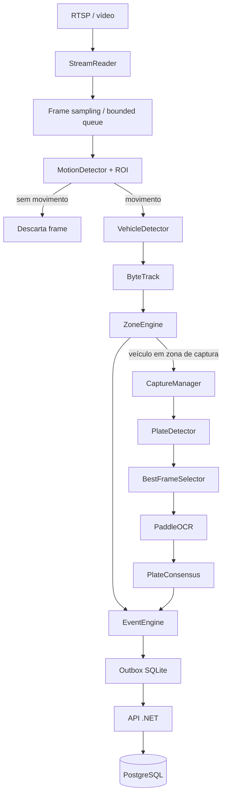

# Plano de implementação para o Codex

## Objetivo

Este documento transforma o estado atual da POC em um roteiro de implementação incremental para o Codex.

A prioridade é reduzir o custo computacional do pipeline de vídeo sem alterar as regras de negócio já validadas: entrada/saída por tracking e zonas, placa opcional, idempotência de eventos e persistência de permanência.

## Princípios obrigatórios

1. Não processar OCR em todos os frames.
2. Não processar detector de placa em todos os frames.
3. Reduzir a taxa efetiva de inferência do detector de veículos.
4. Usar ROI e zonas configuráveis por câmera.
5. Preservar a captura de movimento mesmo quando a placa não for reconhecida.
6. Preservar `event_id`, `visit_id`, `stream_id`, `tracking_lost` e `observed_inside` conforme a documentação atual.
7. Evitar backlog de vídeo: em tempo real, descartar frames antigos é preferível a processá-los atrasados.
8. Não adicionar RabbitMQ, Kafka, Kubernetes ou múltiplos serviços antes de validar a otimização local.

## Arquitetura alvo da próxima etapa



## Fases

### Fase 1 — Medição e observabilidade

Status em 13/09/2026: baseline T01 implementada com contadores de frames, FPS observado e chamadas/erros/média/p95 de veículo+tracking, placa e OCR. 46 testes passaram. Isso não conclui todas as métricas desejadas abaixo: FPS nativo, filas, veículos rastreados, OCR por visita e CPU/memória ainda não são medidos. Medição real comparativa permanece pendente de T10.

Antes de otimizar, medir o comportamento atual.

Implementar métricas locais no serviço de visão:

- FPS bruto recebido da câmera;
- FPS efetivamente enviado ao detector;
- frames descartados;
- tempo médio/p95 do detector de veículos;
- tempo médio/p95 do detector de placas;
- tempo médio/p95 do OCR;
- tamanho atual e máximo das filas internas;
- quantidade de veículos rastreados;
- quantidade de execuções de OCR por visita;
- consumo de CPU e memória do processo quando viável sem dependência pesada adicional.

Critério de aceite:

- logs permitem comparar execução antes e depois da otimização;
- nenhuma alteração de contrato HTTP;
- simulação continua funcionando sem dependências de visão.

### Fase 2 — Sampling de frames e filas limitadas

Status em 13/09/2026: T02 concluída (`PROCESS_FPS`, seleção por tempo e métricas de descarte), com 58 testes Python aprovados. A fila limitada T03 ainda não foi implementada; sampling isolado não comprova ausência de backlog.

Adicionar configuração de taxa de processamento separada da taxa nativa da câmera.

Configuração proposta:

```dotenv
PROCESS_FPS=3
FRAME_QUEUE_SIZE=5
```

Regras:

- a câmera pode operar em 25/30 FPS;
- o pipeline de IA deve receber, por padrão, aproximadamente 3 FPS;
- fila cheia não deve crescer indefinidamente;
- preferir frame mais recente e descartar frames antigos.

Critério de aceite:

- o detector deixa de executar para todos os frames;
- atraso acumulado não cresce durante execução prolongada;
- a aplicação permanece próxima do tempo real.

### Fase 3 — ROI e detecção leve de movimento

Antes do detector de veículos, aplicar uma região de interesse configurável.

Configuração deve continuar normalizada entre 0 e 1 quando possível.

Adicionar `MotionDetector` usando OpenCV, inicialmente com uma técnica simples como background subtraction.

Regras:

- movimento fora da ROI não ativa inferência pesada;
- a ausência de movimento não altera diretamente estados de entrada/saída;
- o mecanismo deve possuir limiar configurável;
- deve ser possível desativá-lo para diagnóstico.

Exemplo de configuração:

```json
{
  "motion": {
    "enabled": true,
    "minimum_changed_ratio": 0.02
  }
}
```

Critério de aceite:

- em cena estática, o número de inferências YOLO reduz drasticamente;
- entrada/saída continua sendo determinada pelo tracking e ZoneEngine, não pelo detector de movimento.

### Fase 4 — Separar detecção de veículo de leitura de placa

O detector de placa e o OCR só devem ser executados quando um veículo rastreado estiver em uma zona de captura configurada.

Fluxo esperado:

```text
vehicle detection -> tracking -> zone transition -> plate capture request -> plate detection -> OCR
```

Regras:

- um veículo sem placa reconhecida ainda gera movimento logístico;
- um mesmo `visit_id` não deve disparar OCR continuamente;
- permitir novas tentativas apenas enquanto a visita estiver em uma janela explícita de captura e ainda não houver consenso suficiente.

Critério de aceite:

- OCR passa de operação contínua para operação orientada a evento;
- logs mostram quantas execuções ocorreram por visita.

### Fase 5 — CaptureManager e BestFrameSelector

Criar um componente que acumula poucos candidatos por veículo antes de executar OCR.

Parâmetros sugeridos:

```dotenv
PLATE_CAPTURE_MAX_FRAMES=5
PLATE_CAPTURE_INTERVAL_MS=150
```

Para cada placa candidata calcular ao menos:

- confiança do detector de placa;
- nitidez com variância do Laplaciano;
- área relativa da placa no frame;
- opcionalmente luminosidade média.

Selecionar o melhor frame por score determinístico e documentado.

Critério de aceite:

- OCR não precisa rodar em todos os candidatos;
- teste unitário cobre ordenação de candidatos;
- o seletor funciona sem PaddleOCR instalado.

### Fase 6 — Concorrência controlada

Separar I/O de câmera e HTTP das etapas de inferência pesada.

Orientação:

- `asyncio` ou threads podem ser usados para I/O;
- inferência pode continuar síncrona dentro de workers dedicados;
- não criar número ilimitado de workers;
- manter filas bounded;
- não carregar múltiplas cópias desnecessárias do mesmo modelo.

Abstrações esperadas:

```text
StreamReader
FrameQueue
DetectionWorker
Tracking/Zone state
PlateQueue
PlateWorker
EventPublisher
```

Critério de aceite:

- OCR lento não bloqueia leitura da câmera;
- queda da API não bloqueia tracking por causa da outbox existente;
- desligamento continua emitindo `tracking_lost` para visitas abertas quando aplicável.

### Fase 7 — Preparar runtime otimizado

Somente depois das fases anteriores.

Avaliar exportação dos detectores para ONNX e ONNX Runtime.

Não substituir a implementação existente de forma irreversível antes de comparar:

- precisão;
- latência;
- CPU;
- compatibilidade de build.

GPU/TensorRT/OpenVINO ficam como evolução posterior, condicionados ao hardware real do CTC.

## Estrutura de classes desejada

A implementação pode evoluir para a seguinte divisão sem exigir uma grande reescrita:

```text
services/vision/dock_vision/
  capture/
    stream_reader.py
  detection/
    motion_detector.py
    vehicle_detector.py
    plate_detector.py
  tracking/
    vehicle_tracker.py
  zones/
    zone_engine.py
  plate/
    capture_manager.py
    best_frame_selector.py
    ocr_service.py
    validator.py
  events/
    event_engine.py
  metrics/
    pipeline_metrics.py
```

Esta estrutura é alvo conceitual. O Codex não deve mover arquivos apenas para atingir esta árvore se a refatoração não trouxer benefício imediato.

## Critérios globais de aceite

Ao concluir a próxima rodada de implementação:

- simulação continua passando;
- API continua compatível;
- nenhuma regra de negócio de entrada/saída muda silenciosamente;
- OCR é acionado sob demanda e não continuamente;
- filas são limitadas;
- pipeline possui métricas básicas;
- documentação é atualizada junto com o código;
- código pode rodar com `OCR_ENABLED=false`;
- inferência real e simulação continuam claramente separadas.

## Fora de escopo desta rodada

- RabbitMQ/Kafka;
- Kubernetes;
- dashboard web;
- armazenamento central de imagens;
- múltiplos CTCs;
- balanceamento distribuído;
- autenticação da API;
- reidentificação de veículos entre tracks;
- treinamento de modelos;
- tuning específico de GPU.
